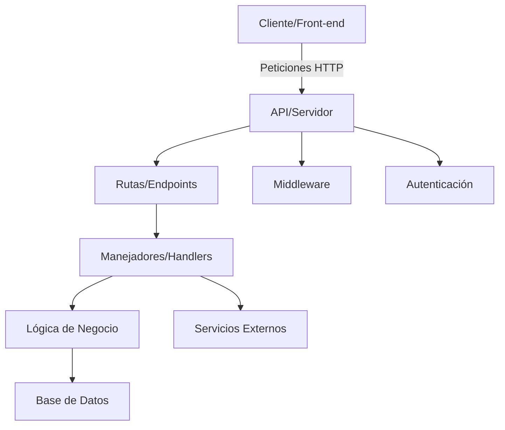

### REST API

Una API (Application Programming Interface) permite a diferentes aplicaciones comunicarse entre sí, generalmente mediante peticiones HTTP. En Go, se puede construir una API con varias partes, desde el manejo de rutas hasta la lógica del negocio y la interacción con bases de datos.

Es un conjunto de reglas y herramientas que permiten que dos aplicaciones o sistemas se comuniquen entre sí.
Una API no especifica cómo debe ser su implementación; puede estar basada en cualquier protocolo (HTTP, RPC, SOAP, etc.).


Componentes usuales de una API REST:


### Diferencia entre api y api rest

La API REST es una variante de la API que se enfoca en la representación de datos en formato JSON. En lugar de utilizar las rutas para definir las interacciones con los clientes, la API REST utiliza los métodos HTTP para definir las interacciones.
### Rutas o Endpoints

Las rutas son los puntos de entrada a las diferentes partes de una API. En Go, se pueden definir rutas usando funciones que se asignan a una ruta específica. Por ejemplo, si queremos crear una ruta para obtener todos los usuarios, podemos definir una función llamada `getUsers` que se asigne a la ruta `/users`.

```go
func getUsers(w http.ResponseWriter, r *http.Request) {
    // Código para obtener los usuarios
}

func main() {
    http.HandleFunc("/users", getUsers)
    http.ListenAndServe(":8080", nil)
}
```

### Manejadores

Los manejadores son funciones que se encargan de procesar las peticiones HTTP y devolver una respuesta. En Go, se pueden definir manejadores para diferentes métodos HTTP, como GET, POST, PUT, DELETE, etc.

```go
func getUsers(w http.ResponseWriter, r *http.Request) {
    // Código para obtener los usuarios
}

func createUser(w http.ResponseWriter, r *http.Request) {
    // Código para crear un usuario
}

func main() {
    http.HandleFunc("/users", getUsers)
    http.HandleFunc("/users", createUser)
    http.ListenAndServe(":8080", nil)
}
```

### Lógica de Negocio

La lógica de negocio es el código que se encarga de realizar las operaciones de negocio, como la obtención de datos, la manipulación de datos, la validación de datos, la creación de datos, la actualización de datos, la eliminación de datos, etc.

En Go, se pueden definir funciones que se encargan de realizar las operaciones de negocio. Por ejemplo, si queremos obtener todos los usuarios, podemos definir una función llamada `getUsers` que se encarga de obtener los usuarios de la base de datos y devolverlos como una lista de objetos `User`.

```go
type User struct {
    ID    int    `json:"id"`
    Name  string `json:"name"`
    Email string `json:"email"`
}

var users = []User{}

func getUsers() []User {
    // Código para obtener los usuarios de la base de datos
    return users
}

func main() {
    http.HandleFunc("/users", func(w http.ResponseWriter, r *http.Request) {
        users := getUsers()
        w.Header().Set("Content-Type", "application/json")
        json.NewEncoder(w).Encode(users)
    })
    http.ListenAndServe(":8080", nil)
}
```

### Base de Datos

La base de datos es el lugar en el que se almacenan los datos de la aplicación. En Go, se pueden utilizar diferentes librerías de bases de datos, como SQLite, MySQL, PostgreSQL, etc. Para utilizar una base de datos en Go, se debe importar la librería correspondiente y establecer una conexión con la base de datos.

```go
import (
    "database/sql"
    _ "github.com/mattn/go-sqlite3"
)

func main() {
    db, err := sql.Open("sqlite3", "users.db")
    if err != nil {
        log.Fatal(err)
    }
    defer db.Close()

    // Código para manipular la base de datos
}
```

### Middleware

Middleware es una técnica de programación que se utiliza para agregar funcionalidad a una aplicación. En Go, se pueden utilizar middleware para agregar funcionalidad como autenticación, autorización, logging, etc.


### Por qué es RESTful

Sigue estrictamente los principios REST.
Los métodos y rutas son consistentes con las acciones realizadas.
Los recursos están representados de forma uniforme.